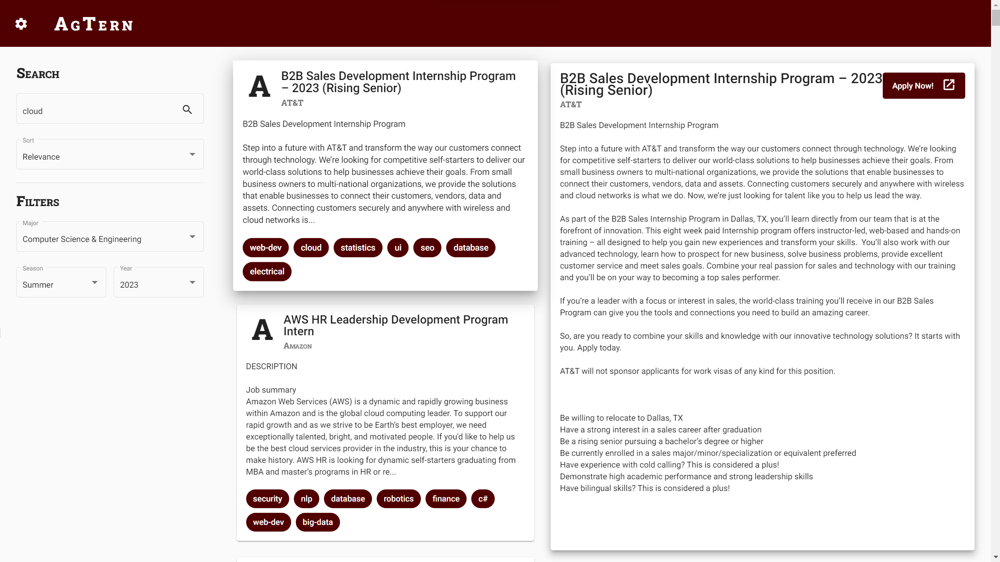

.. role:: raw-latex(raw)
   :format: latex
..

.. raw:: html

   <!-- This license only applies to THIS file. Link to awesome README template: https://github.com/othneildrew/Best-README-Template
   MIT License

   Copyright (c) 2021 Othneil Drew

   Permission is hereby granted, free of charge, to any person obtaining a copy
   of this software and associated documentation files (the "Software"), to deal
   in the Software without restriction, including without limitation the rights
   to use, copy, modify, merge, publish, distribute, sublicense, and/or sell
   copies of the Software, and to permit persons to whom the Software is
   furnished to do so, subject to the following conditions:

   The above copyright notice and this permission notice shall be included in all
   copies or substantial portions of the Software.

   THE SOFTWARE IS PROVIDED "AS IS", WITHOUT WARRANTY OF ANY KIND, EXPRESS OR
   IMPLIED, INCLUDING BUT NOT LIMITED TO THE WARRANTIES OF MERCHANTABILITY,
   FITNESS FOR A PARTICULAR PURPOSE AND NONINFRINGEMENT. IN NO EVENT SHALL THE
   AUTHORS OR COPYRIGHT HOLDERS BE LIABLE FOR ANY CLAIM, DAMAGES OR OTHER
   LIABILITY, WHETHER IN AN ACTION OF CONTRACT, TORT OR OTHERWISE, ARISING FROM,
   OUT OF OR IN CONNECTION WITH THE SOFTWARE OR THE USE OR OTHER DEALINGS IN THE
   SOFTWARE.
   -->

.. raw:: html

   <!-- PROJECT SHIELDS -->

.. raw:: html

   <!--
   *** I'm using markdown "reference style" links for readability.
   *** Reference links are enclosed in brackets [ ] instead of parentheses ( ).
   *** See the bottom of this document for the declaration of the reference variables
   *** for contributors-url, forks-url, etc. This is an optional, concise syntax you may use.
   *** https://www.markdownguide.org/basic-syntax/#reference-style-links
   -->

|Contributors| |Forks| |Stargazers| |Issues|

.. raw:: html

   <!-- PROJECT LOGO -->

.. container::

   .. raw:: html

      <h3 align="center">

   AgTern

   .. raw:: html

      <div align="center">
        
      </div>

      </h3>

   .. raw:: html


   Howdy! AgTern is a program that helps students find, track, and apply
   to internships by scraping the web for job postings. Based off a
   student profile (major, graduation date, industry interests, etc.),
   it retrieves scraped internships that are most relevant to the
   student. AgTern was built because searching for internships that
   match your interests and situation can be hard. We wanted the process
   to be as seamless as possible so that students can focus on applying
   and not searching. Explore the docs (TODO)» Read the wiki » View Demo
   · Report Bug

   .. raw:: html

      </p>

.. raw:: html

   <!-- TABLE OF CONTENTS -->

.. raw:: html

   <details>

.. raw:: html

   <summary>

Table of Contents

.. raw:: html

   </summary>

.. raw:: html

   <ol>

.. raw:: html

   <li>

About The Project

.. raw:: html

   <ul>

.. raw:: html

   <li>

Current Features

.. raw:: html

   </li>

.. raw:: html

   <li>

Images

.. raw:: html

   </li>

.. raw:: html

   <li>

Built With

.. raw:: html

   </li>

.. raw:: html

   </ul>

.. raw:: html

   </li>

.. raw:: html

   <li>

Getting Started

.. raw:: html

   <ul>

.. raw:: html

   <li>

Installation

.. raw:: html

   </li>

.. raw:: html

   <li>

Running

.. raw:: html

   </li>

.. raw:: html

   </ul>

.. raw:: html

   </li>

.. raw:: html

   <li>

Contributing

.. raw:: html

   </li>

.. raw:: html

   <li>

Contact

.. raw:: html

   </li>

.. raw:: html

   <li>

Acknowledgments

.. raw:: html

   </li>

.. raw:: html

   </ol>

.. raw:: html

   </details>

.. raw:: html

   <!-- ABOUT THE PROJECT -->

About The Project
=================

Current Features
----------------

-  Scrapes over 30 company job sites (over 1500 internships!)
-  Search interface to search job keywords
-  Displays relevant information about found internships

   -  Company
   -  Title
   -  Date of internship (e.g. Summer 2023)
   -  Link to apply

Images
------



   AgTern in Action

.. raw:: html

   <p align="right">

(back to top)

.. raw:: html

   </p>

Built With
----------

-  |Python|
-  |FastAPI|
-  |SQLite|
-  |Angular|
-  |DigitalOcean|

.. raw:: html

   <p align="right">

(back to top)

.. raw:: html

   </p>

.. raw:: html

   <!-- GETTING STARTED -->

Getting Started
===============

To set up your project locally and get it running, follow these simple
steps.

Installation
------------

Complete all the parts below (in order) for a complete installation.

Part 1: Git Setup
~~~~~~~~~~~~~~~~~

1. Install `Git <https://git-scm.com/downloads>`__
2. Clone the repository:
   ``git clone https://github.com/johndpjr/AgTern.git``
3. Navigate to the ``AgTern`` directory
4. Change to ``dev`` branch: ``git checkout dev``

Part 2: Backend Setup
~~~~~~~~~~~~~~~~~~~~~

1. Install `Python <https://www.python.org/downloads/>`__

2. Create a virtual environment and activate it (run at repo root)
   \```sh pip3 install virtualenv python3 -m virtualenv venv virtualenv
   venv

   # Linux & MacOS source venv/bin/activate # Windows
   .:raw-latex:`\venv`:raw-latex:`\Scripts`:raw-latex:`\activate` \``\`

3. Install Python packages: ``pip3 install -r requirements.txt``

Part 3: Frontend Setup
~~~~~~~~~~~~~~~~~~~~~~

1. Install `NodeJS <https://nodejs.org/en>`__
2. Navigate to the ``frontend`` directory
3. Build the frontend ``sh     npm install     npm run build``

.. raw:: html

   <p align="right">

(back to top)

.. raw:: html

   </p>

Running
-------

*Note: if you are running the program for the first time, you either
need to download the database (see #file-upload in Discord for file) or
run a scraping job to populate jobs in a database*

Option 1: Command Line
~~~~~~~~~~~~~~~~~~~~~~

Common commands to run the program (make sure you’re in the ``AgTern``
directory):

**Run frontend and backend:** 1. Navigate to the ``frontend`` directory
2. ``npm run start`` 3. (Open a new terminal) Run in repo root:
``python3 -m backend --dev --no-scrape`` 4. Goto ``localhost:8000`` in
your web browser

**Run scraper command (only scrape):**
``python3 -m agtern --dev --scrape-only --save-jobs``

Option 2: PyCharm
~~~~~~~~~~~~~~~~~

If you are using `PyCharm <https://www.jetbrains.com/pycharm/>`__ (it’s
free for students!), run configurations are already defined in the
``.idea`` folder. You should be able to run all configurations without
issue.

Option 3: Docker Run
~~~~~~~~~~~~~~~~~~~~

1. Install `Docker <https://www.docker.com/>`__
2. Start Docker container: ``docker-compose up``
3. Goto ``localhost:8000`` in your web browser

*Note: Right now, the container won’t auto-reload (detect local changes
and rebuild), but this is planned!*

.. raw:: html

   <p align="right">

(back to top)

.. raw:: html

   </p>

.. raw:: html

   <!-- CONTRIBUTING -->

Contributing
============

*Contributions are only open to students currently enrolled at Texas A&M
University, as this is a club project for Aggie Coding Club.*

Contributions give life to the project: without them this project dies.

Our list of tasks can be found on our GitHub `projects
page <https://github.com/users/johndpjr/projects/2/views/1>`__. Feel
free to add issues to the project: these can be bugs, feature requests,
or just observations. If you are interested in a ticket (that is not
assigned already), assign it to yourself, make your changes, and create
a pull request completing the task.

1. Assign the task to yourself and set the status as “In Progress”
2. Ensure you’re on the ``dev`` branch with the latest changes
   ``bash     git checkout dev     git pull``
3. Create your feature branch:
   ``git checkout -b feature/ticket#/short-description``
4. Implement feature/bug fix and stage your changes: ``git add .``
5. Commit your changes with the following format:
   ``git commit -m 'AT-ticket#: Add some feature``
6. Push to the remote branch: ``git push``
7. Open a `pull request <https://github.com/johndpjr/AgTern/pulls>`__ to
   merge your feature branch into ``dev``

.. raw:: html

   <p align="right">

(back to top)

.. raw:: html

   </p>

.. raw:: html

   <!-- CONTACT -->

Contact
=======

Project Manager - John Powell -
`Email <mailto:johndpowell02@gmail.com>`__

Project Link: https://github.com/johndpjr/AgTern

.. raw:: html

   <p align="right">

(back to top)

.. raw:: html

   </p>

.. raw:: html

   <!-- ACKNOWLEDGMENTS -->

Acknowledgments
===============

-  All contributors: No matter the amount, each contributor on our team
   is appreciated for the work they do. Thank you!
-  Aggie Coding Club: Continues to provide resources, contributors, and
   project advice. Thank you ACC!

.. raw:: html

   <p align="right">

(back to top)

.. raw:: html

   </p>

.. raw:: html

   <!-- MARKDOWN LINKS & IMAGES -->

.. raw:: html

   <!-- https://www.markdownguide.org/basic-syntax/#reference-style-links -->
.. |Contributors| image:: https://img.shields.io/github/contributors/johndpjr/AgTern.svg?style=for-the-badge
   :target: https://github.com/johndpjr/AgTern/graphs/contributors
.. |Forks| image:: https://img.shields.io/github/forks/johndpjr/AgTern.svg?style=for-the-badge
   :target: https://github.com/johndpjr/AgTern/network/members
.. |Stargazers| image:: https://img.shields.io/github/stars/johndpjr/AgTern.svg?style=for-the-badge
   :target: https://github.com/johndpjr/AgTern/stargazers
.. |Issues| image:: https://img.shields.io/github/issues/johndpjr/AgTern.svg?style=for-the-badge
   :target: https://github.com/johndpjr/AgTern/issues
.. |Python| image:: https://img.shields.io/badge/python-306998?style=for-the-badge&logo=python&logoColor=white
   :target: https://www.python.org/
.. |FastAPI| image:: https://img.shields.io/badge/fastapi-009485?style=for-the-badge&logo=fastapi&logoColor=white
   :target: https://fastapi.tiangolo.com/
.. |SQLite| image:: https://img.shields.io/badge/sqlite-44a2d4?style=for-the-badge&logo=sqlite&logoColor=white
   :target: https://www.sqlite.org/index.html
.. |Angular| image:: https://img.shields.io/badge/Angular-DD0031?style=for-the-badge&logo=angular&logoColor=white
   :target: https://angular.io/
.. |DigitalOcean| image:: https://img.shields.io/badge/DigitalOcean-%230167ff.svg?style=for-the-badge&logo=digitalOcean&logoColor=white
   :target: https://www.digitalocean.com/
